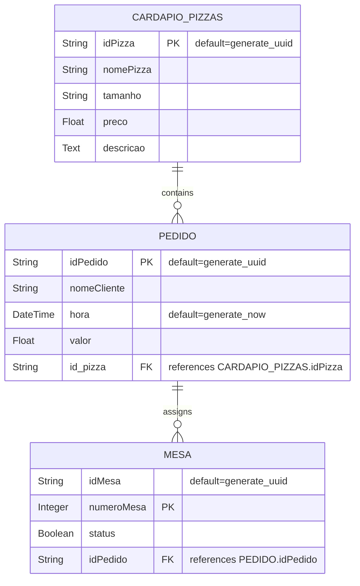

```mermaid
erDiagram
    CARDAPIO_PIZZAS {
        String idPizza PK "default=generate_uuid"
        String nomePizza
        String tamanho
        Float preco
        Text descricao
    }
    
    PEDIDO {
        String idPedido PK "default=generate_uuid"
        String nomeCliente
        DateTime hora "default=generate_now"
        Float valor
        String id_pizza FK "references CARDAPIO_PIZZAS.idPizza"
    }
    
    MESA {
        String idMesa "default=generate_uuid"
        Integer numeroMesa PK
        Boolean status
        String idPedido FK "references PEDIDO.idPedido"
    }
    
    CARDAPIO_PIZZAS ||--o{ PEDIDO: contains
    PEDIDO ||--o{ MESA: assigns

```